# 1. Гусейнова Сабина Гасановна ИС-22/9-1
## 2. Описание базы данных "PCSHOP"
База данных для хранения информации о клиентах, их покупках и товарах из магазина компьютерных комплектующих
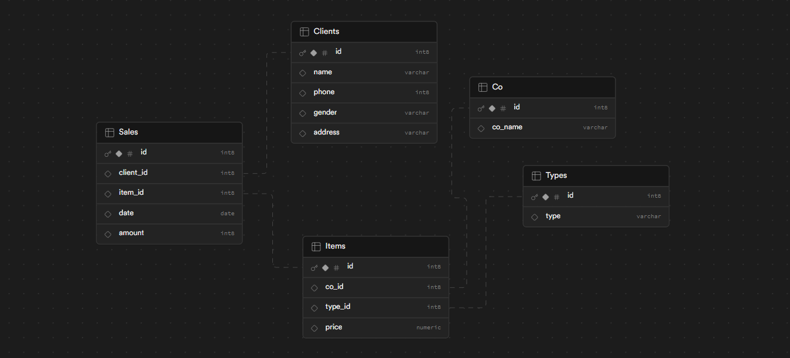 

### 2.1. Таблица "Co" /Компании

 - id  (INTEGER, PRIMARY KEY) - уникальный идентификатор 
 - co_name (varchar(30)) - название компании

 

 - Вывод данных из таблицы

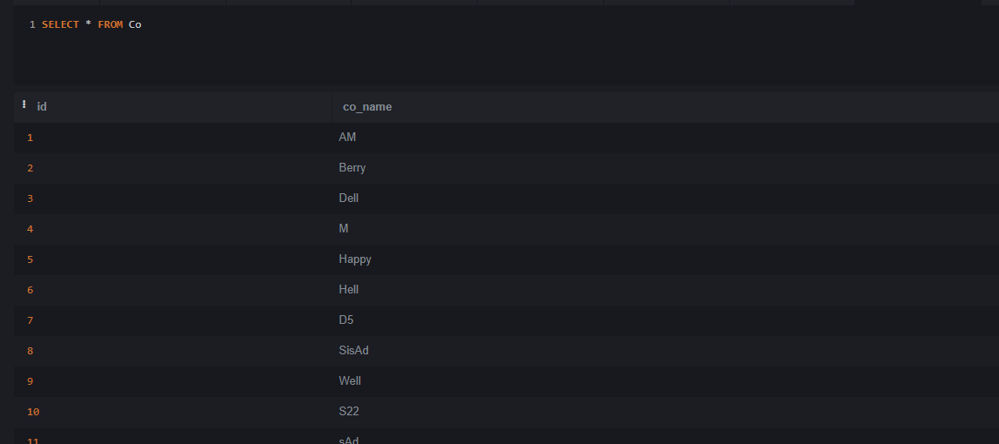


### 2.2. Таблица "Clients" /Клиенты

 - id (INTEGER, PRIMARY KEY) - уникальный идентификатор покупателя
 - name (VARCHAR(30)) - имя + фамилия
 - phone (INT) - телефон
 - gender (VARCHAR(3)) - пол
 - address (VARCHAR(30)) - адрес 

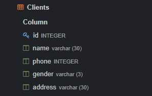

 - Вывод данных из таблицы

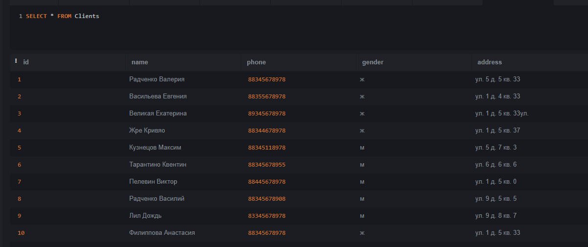 

### 2.3. Таблица "Types" /Виды

 - id (INTEGER, PRIMARY KEY) - уникальный идентификатор видов
 - type (VARCHAR(30)) - название вида

 

 - Вывод данных из таблицы

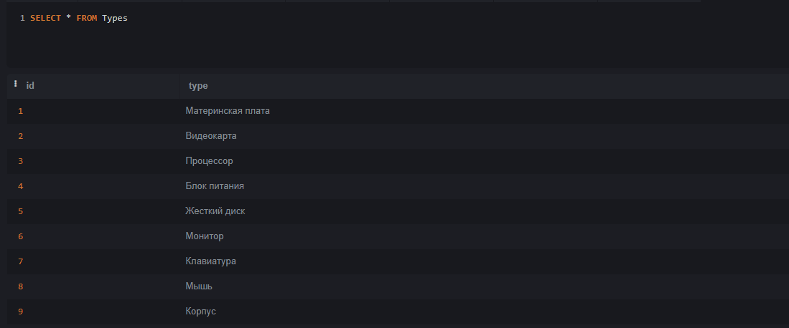

### 2.4. Таблица "Items" /Комплектующая

 - id (INTEGER, PRIMARY KEY) - уникальный идентификатор комплектующей
 - price (NUMERIC) - цена 
 - co_id (INT) - идентификатор компании (связь с таблицей Co по полю id )
 - type_id (INT) - идентификатор вида (связь с таблицей Types по полю id )

	Промежуточная таблица, для реализации связи многие к многим (между Co и Types)

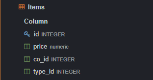 

 - Вывод данных из таблицы

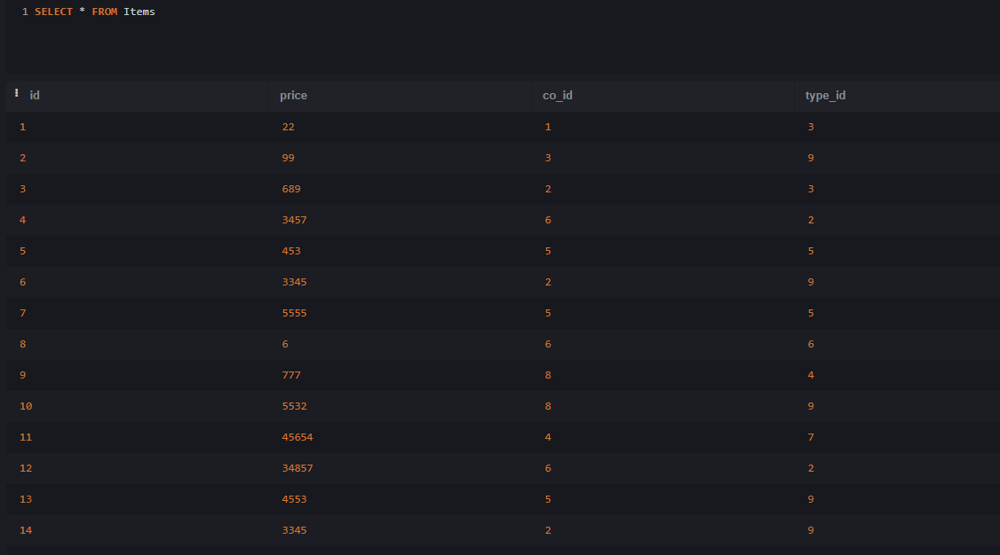


### 2.5. Таблица "Sales" /Покупки

 - id (INTEGER, PRIMARY KEY) - уникальный идентификатор покупки
 - sale_date (DATE) - дата покупки
 - amount (INT) - количество приобретенных товаров
 - client_id (INT) - идентификатор покупателя (связь с таблицей Clients по полю id)
 - item_id (INT) - уникальный идентификатор комплектующей (связь с таблицей Items по полю id )
  
	Связь с таблицами Clients и Items (один к многим)
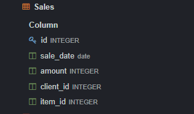 

 - Вывод данных из таблицы

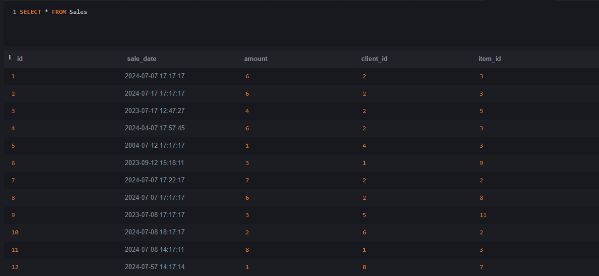


## 3.UNION

Объеденный вывод из двух таблиц ()

```
SELECT * FROM Types
UNION
SELECT * FROM Co
LIMIT 4
```
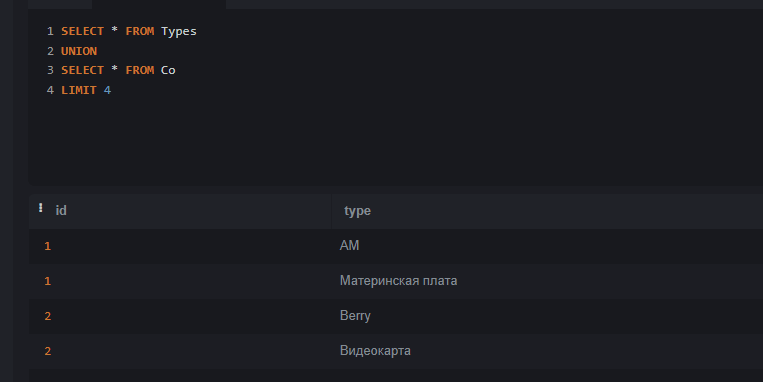


## 4.ORDER BY

Сортировка видов в алфавитном порядке

```
SELECT type FROM Types 
ORDER BY 1 ASC
```
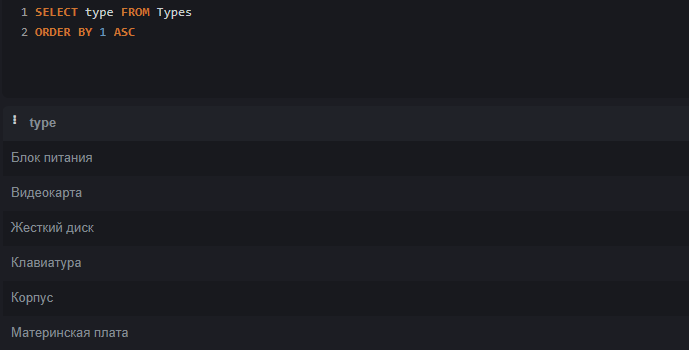 


## 5.HAVING

Вывод цены комплектующей с идентификатором 3

```
SELECT price FROM Items  
GROUP BY co_id
Having type_id = 3
```
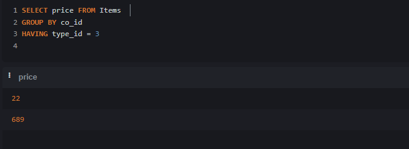 


## 6. Демонстрация работы вложенных запросов

### 6.1. В SELECT

Вывод средней цены  и количества

```
SELECT AVG(price) as Средняя_Цена,
	(SELECT SUM(amount)
         FROM Sales
  		) as Количество 
FROM Items
GROUP BY co_id
LIMIT 1
```
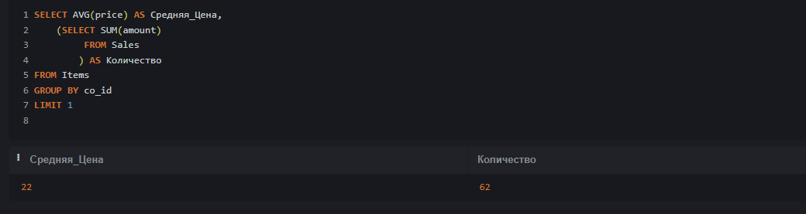 


### 6.2. В WHERE

Вывод имен покупателей Dell
```
SELECT name FROM Clients
WHERE id IN (SELECT client_id FROM Sales
     		WHERE item_id IN 
  				( SELECT id FRom Items
				 WHERE co_id IN 
                  		 	(SELECT id FROM Co
                     			WHERE co_name = 'Dell')
                 		)
	 )
GROUP BY 1
```
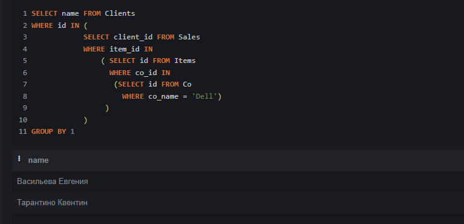 


## 7.Оконные функции

### 7.1.Агрегатные функции

Вывод минимальной, максимальной и средней стоимости, общей суммы и количества компаний

```
SELECT 
    MIN(Price) AS Минимальная_Стоимость,
    MAX(Price) as Максимальная_Стоимость,
    SUM(Price) as Сумма,
    AVG(Price) as Средняя_Стоимость,
    (SELECT COUNT(co_id)
    FROM Items) AS Количество_Компаний
FROM Items
```
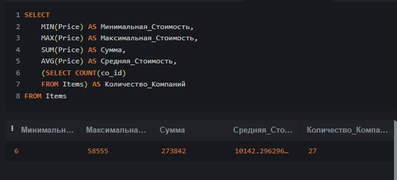

### 7.2.Ранжирующая функция

Проранжирование комплектующих, отсортированных по цене

```
SELECT item_id, row_number() over(ORDER BY amount) as rang
FROM Sales
GROUP By item_id
```
  


## 7.3.Функция смещения

Вывод списка отсортированного в алфавитном порядке (в количестве 6 записей) видов комплектующих без учета первого значения

```
SELECT type 
FROM Items JOIN Types On
Types.id = Items.type_id
GROUP BY 1
ORDER BY 1 ASC
LIMIT 6 OFFSET 1
```
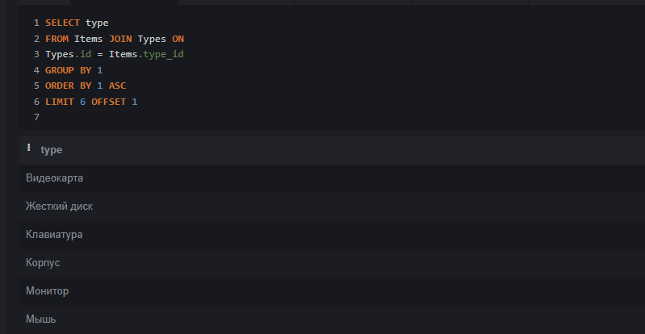 


## 8.JOIN

### 8.1.INNER JOIN

Вывод названий компаний, имеющие в арсенале комплектующие с ценой меньше заданной

```
SELECT co_name FROM Co 
JOIN Items ON Co.id = Items.co_id
Where price < 200
GROUP BY 1
```
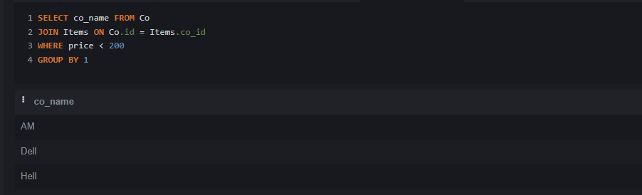 


### 8.2.LEFT JOIN
Вывод имен клиентов и дат покупок

```
SELECT name, sale_date FROM Clients
LEFT JOIN Sales ON Clients.id = Sales.client_id
GROUP BY 1
```
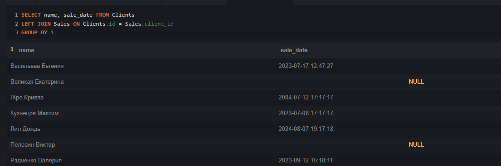 


### 8.3.RIGHT JOIN

Вывод имен клиентов и дат покупок

```
SELECT name, sale_date FROM Clients
RIGHT JOIN Sales ON Clients.id = Sales.client_id
GROUP BY 1
```
 


### 8.4.FULL OUTER JOIN

Вывод видов комплектующих, их количества и имен только тех покупателей, которые совершали покупки

```
SELECT name, amount, type FROM Clients
FULL OUTER JOIN Sales ON Clients.id = Sales.client_id
FULL OUTER JOIN Items ON Sales.item_id = Items.id
Full OUTER JOIn Types ON Types.id = Items.type_id
WHERE amount IS NOT NULL
GROUP BY name
```
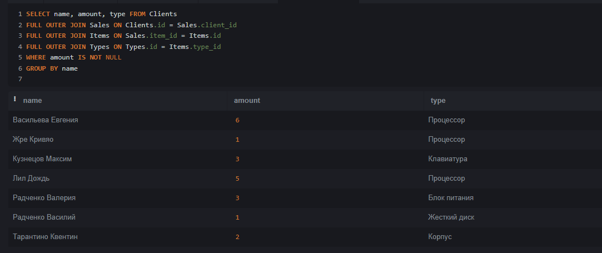 


### 8.5.CROSS JOIN

Вывод всех возможных сочетаний названий компаний и видов комплектующих

```
SELECT co_name, type FROM Co 
CROSS JOIN
Types
```
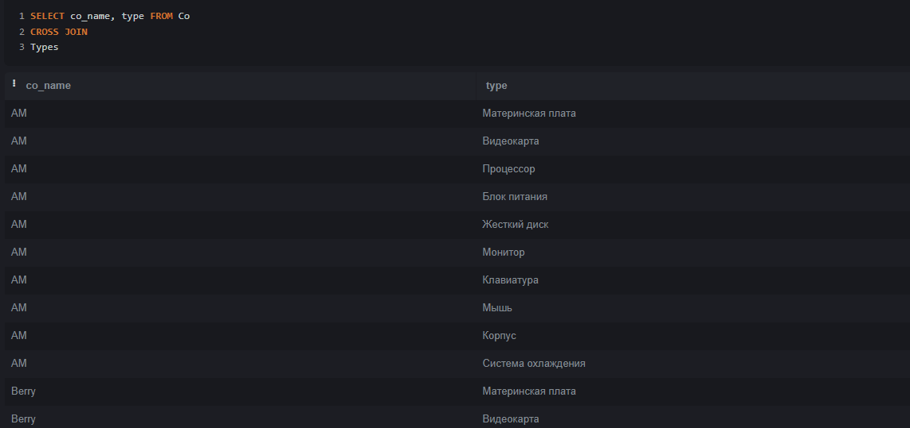 


## 9.CASE

Данные о цене отбираются согласно условиям, по которым им присуждается определенная категория

```
SELECT price,
       CASE
           WHEN price < 8 THEN 'АнтиМажор'
           ELSE 'Люкс'
       END AS price_category
FROM Items;
```
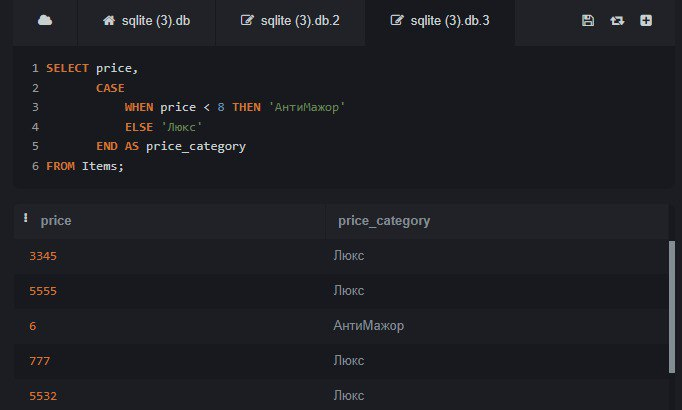 


## 10.WITH

Создается временнная таблица Cod, из которой выводятся все данные

```
WITH Cod AS
	(SELECT co_name 
 	FROM  Co
	WHERE co_name LIKE 'S%')
SELECT * FROM Cod
```
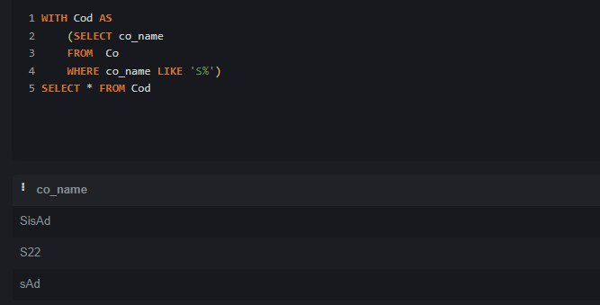 
